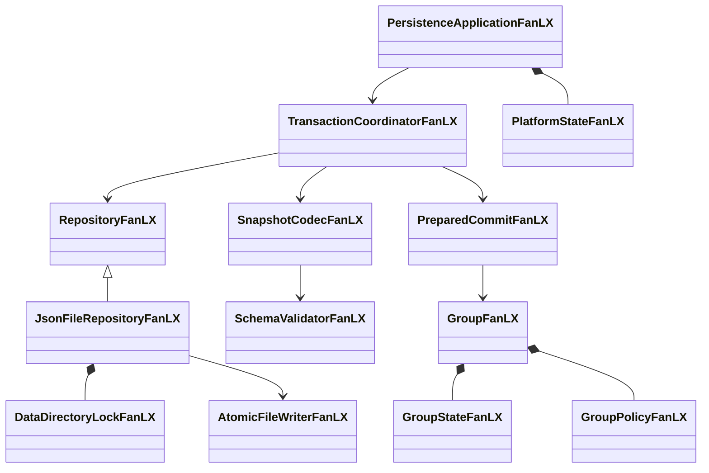

# 架构说明 — 樊陆旭模拟即时通讯系统

## 分层概览

```
┌─────────────────────────────────────────────────────────┐
│  Presentation / Entry（入口层）                          │
│  main.cpp · ConsoleAppFanLX（待实现）                   │
├─────────────────────────────────────────────────────────┤
│  Application / Service（业务服务层）                     │
│  AccountManagerFanLX · FriendServiceFanLX               │
│  GroupServiceFanLX（S04/S05 已实现）                           │
├─────────────────────────────────────────────────────────┤
│  Domain（领域层）                                        │
│  UserProfileFanLX · ServiceAccountFanLX                 │
│  FriendDirectoryFanLX · IdentityResolverFanLX           │
│  GroupFanLX · GroupStateFanLX · DiscussionGroupFanLX    │
│  GroupPolicyFanLX（抽象）及其子类                        │
├─────────────────────────────────────────────────────────┤
│  Infrastructure（基础设施层）                            │
│  LruListFanLX · LruCacheFanLX · ArcCacheFanLX          │
│  LfuFrequencyFanLX · MemoryPoolFanLX                    │
│  JsonFileRepositoryFanLX（S06 已实现）                       │
└─────────────────────────────────────────────────────────┘
```

依赖方向：上层依赖下层，下层不依赖上层。

---

## 已实现类关系

### 账户域（S02）

```
ServiceTypeFanLX（enum class）
    QQ / Wechat / Weibo

UserProfileFanLX（struct）
    userId · nickname · birthDate · applyDate · location

ServiceAccountFanLX（struct）
    userId · service · accountId · sharedId

AccountManagerFanLX（后端层：以内部 userId 为键）
    ├── usersFanLX         : unordered_map<string, UserProfileFanLX>
    ├── accountsFanLX      : unordered_map<string, ServiceAccountFanLX>
    ├── accountIdIndexFanLX: unordered_map<string, string>  // "服务名|账号ID" -> 账号键（唯一性 + O(1) 定位）
    ├── subscriptionsFanLX : unordered_set<string>   // 存储键 "userId|服务名"
    ├── bindingsFanLX      : unordered_map<string, string>  // 账号键 -> 与之绑定的另一账号键
    └── loggedInFanLX      : unordered_set<string>   // 登录态，以"平台账号"为主体
    后端配给：addUser · addAccount · subscribe
    前端入口：login（签发会话）
    后端查询：isSubscribed · isLoggedIn · profile · account · findAccount · accounts
    平台账号视角：hasAccount · isAccountSubscribed · isAccountLoggedIn · accountByAccountId
                 logout · logoutAll · bindAccounts · unbindAccounts · isBound · bindingsOf

AccountSessionFanLX（前端身份凭证，由 login 签发）
    ├── service() · accountId()                    // 对外的全部身份信息
    ├── isLoggedIn()                               // 会话是否仍有效
    ├── subscribeTo(service)                       // 自主开通
    ├── bindTo / unbindFrom / boundAccounts        // 绑定：建立 / 解除 / 查询
    ├── logout() / logoutAll()                     // 当前服务注销 / 平台注销
    └── 私有 userIdFanLX（无访问器，前端取不到）

服务错误分类（均继承 std::runtime_error）
    ServiceNotSubscribedFanLX（未开通）· ServiceNotConfirmedFanLX（未确认）· SessionExpiredFanLX（已过期）
```

**身份分层与接口分层（2026-09-14 修订 rev2，对齐工程计划 §4.1、§4.2）**

三层身份：**人**以不可变内部 `userId` 标识；**服务账号**以 `(ServiceType, accountId)` 标识；
**开通记录**以 `(userId, ServiceType)` 标识。由此推出接口分层：

- **前端 API = 登录会话**：凡"由某个已登录用户发起"的操作一律经由 `AccountSessionFanLX`，
  签名中不出现 `userId`；对方一律以平台账号 `(service, accountId)` 指定。
  现实中加好友用的是对方的 QQ 号 / 微信号，不是后台用户 ID。
- **后端 API = 配给/统计/持久化**：注册用户、建号、开通、按用户查询保留在 `AccountManagerFanLX`
  上并显式以 `userId` 为参数，前端不调用。
- `login(service, accountId, confirmOthers)` 是唯一登录入口（旧有的 userId 版重载已删除）：
  平台侧校验凭据后系统拿到的是账号 ID，再由账号反查归属用户。
- `confirmOthers == true` 的联动**只依据两条规则**：
  1. **同号**：双方 `sharedId == true` 且 `accountId` 相同（QQ 与微博复用同一账号 ID）；
  2. **显式绑定**：`bindingsFanLX` 中存在双向绑定记录。

  仅"同一个人"而既不同号也未绑定时**不联动**，避免登录 QQ 顺带登录无关平台。
  联动范围仅限该用户**已开通**的平台。
- **绑定**以平台账号为参数（`bindAccounts` / 会话的 `bindTo`），归属校验在内部完成：
  双方必须属于同一 `userId`，因此"输入任意 QQ 号就能绑定他人账号"会被拒绝；
  提供建立 / 查询（`isBound`、`bindingsOf`）/ 解除（`unbindAccounts`）三组接口。
- **账号 ID 唯一性**：`addAccount` 保证同一平台的 `accountId` 不被两人共用——
  既然 accountId 是登录身份，它就必须能唯一定位账号；索引 `accountIdIndexFanLX` 同时承担该校验。
- 不变量：`addAccount` 保证「一个用户在一个平台只持有一个账号」，因此存储键 `"userId|服务名"`
  是该平台账号的无损别名；好友域 `IdentityResolverFanLX` 的 3 段键 `"userId|服务名|accountId"`
  在此不变量下第三段不产生新维度，保留以维持键格式对上层稳定。

### 好友域（S03）

```
FriendshipFanLX（struct）
    ownerAccountKey · peerAccountKey · remark · tag

FriendDirectoryFanLX
    ├── adjacencyFanLX : unordered_map<string, unordered_set<string>>  // 无向图
    └── detailsFanLX   : unordered_map<string, FriendshipFanLX>        // 键 "owner\npeer"
    方法：contains · add · remove · update · detail · peers · clear

IdentityResolverFanLX
    └── accountsFanLX : const AccountManagerFanLX&
    方法：accountKey（service+accountId → "userId|服务名|accountId"）   // 前端口径
         accountKeyOfUser（userId+service → 账号键，缺失返回空串）      // 内部口径
         userForAccount（账号键 → userId）                            // 仅内部聚合使用

FriendServiceFanLX（门面）
    ├── directoryFanLX : FriendDirectoryFanLX&
    ├── accountsFanLX  : const AccountManagerFanLX&
    └── resolverFanLX  : IdentityResolverFanLX（组合成员）
    签名口径（rev2）：发起方 = AccountSessionFanLX，对方 = (ServiceType, accountId)
    方法：addFriend(self, peerService, peerAccountId)
         removeFriend(同) · updateRemark(同 + remark/tag)
         findFriends(self) · commonFriends(self, otherService, otherAccountId)
         crossServiceCommonFriends(first, second)   // 两个会话须属于同一 userId
         recommendFriends(source, target)           // 同上；会话失效抛 SessionExpiredFanLX
```

### 群策略（S01，完整）

```
GroupModeFanLX（enum class）: QQ / Wechat

GroupPolicyFanLX（抽象基类）
    +canCreateDiscussion() : bool = 0
    +name() : string        = 0
    +~GroupPolicyFanLX()    // 虚析构

    ┌─────────────────────────┬──────────────────────────┐
    │ QQGroupPolicyFanLX      │ WechatGroupPolicyFanLX   │
    │ canCreateDiscussion=true│ canCreateDiscussion=false│
    └─────────────────────────┴──────────────────────────┘
```

### 群域（S04，完整实现，`--demo` 待补）

```
GroupRoleFanLX（enum class）: Owner / Admin / Member

GroupKeyFanLX（struct）
    mode : GroupModeFanLX
    id   : string
    operator==

GroupKeyHashFanLX（struct）
    operator()  →  hash(id) ^ (size_t(mode) << 1)

GroupFanLX（稳定外壳）
    ├── keyFanLX    : GroupKeyFanLX
    ├── policyFanLX : unique_ptr<GroupPolicyFanLX>   // 运行时多态，可交换
    └── membersFanLX: unordered_map<string, GroupRoleFanLX>
    方法（已实现）：
        addMember(id, role=Member) → bool   // 重复返回 false
        setRole(id, role)                   // 不存在抛 out_of_range
        hasMember(id) → bool
        roleOf(id) → GroupRoleFanLX
        members() → vector<string>          // 字典序排序
        canCreateDiscussion() → bool        // 委托策略
        removeMember(actor, target) → bool  // 权限矩阵：
            不能踢群主 / 不能踢自己
            Member 无踢人权
            Admin 不能踢同级 Admin
    方法：
        leave(userId) → bool            // Owner 退群前抛异常
        transferOwnership(newOwner)      // 先存在性检查再修改，自转让净结果正确

GroupApplicationFanLX（struct）
    applicant : string
    pending   : bool = true

GroupInvitationFanLX（struct）
    inviter : string
    invitee : string
    pending : bool = true

DiscussionGroupFanLX（子群）
    ├── idFanLX      : string
    └── membersFanLX : unordered_set<string>
    方法：
        addMember(parent, id) → bool   // 前置检查 parent.hasMember(id)
        hasMember(id) → bool
        removeMember(id) → bool         // Service 退群时调用，子群同步清理

GroupServiceFanLX
    ├── groupsFanLX       : unordered_map<GroupKeyFanLX, GroupFanLX, Hash>
    ├── applicationsFanLX : unordered_map<GroupKeyFanLX, map<string, GroupApplicationFanLX>, Hash>
    ├── invitationsFanLX  : unordered_map<GroupKeyFanLX, map<string, GroupInvitationFanLX>, Hash>
    └── discussionsFanLX  : unordered_map<GroupKeyFanLX, map<string, DiscussionGroupFanLX>, Hash>
    方法（已全部实现）：
        create / get
        applyToJoin / approveApplication / rejectApplication  // QQ 申请流
        inviteMember / confirmInvitation / rejectInvitation   // Wechat 邀请流
        leave(key, userId)               // 退群 + 子群同步 + inviter 邀请撤销
        transferOwnership(key, actor, newOwner)
        dissolve(key, actor)             // 清空全部工作流后移除群对象
        createDiscussion / getDiscussion
        pendingApplicationCount / pendingInvitationCount  // 只读计数
```

### 缓存系统（S07，完整）

```
LruListFanLX<K,V,H>（可复用 LRU 段底座）
    ├── listFanLX      : list<EntryFanLX>                   // LRU 次序
    ├── routeFanLX     : unordered_map<K, iterator, H>      // O(1) 定位
    └── usedBytesFanLX : size_t                             // 字节账目（增量维护）
    接口：pushFront · moveToFront · take · popBack · erase · evictToFit
         locate · peek · contains · size · bytes

LruCacheFanLX<K,V,H>（2Q / LRU-K）
    ├── bufferFanLX : LruListFanLX   // Buffer（新数据入口，约 1/4 容量）
    └── mainFanLX   : LruListFanLX   // Main（热数据，约 3/4 容量）
    晋升：Buffer 中访问达 kFanLX 次 → 搬入 Main 队首

LfuFrequencyFanLX<K,H>（独立频次控制器）
    ├── frequenciesFanLX  : unordered_map<K, size_t, H>
    └── totalAccessFanLX  : size_t    // 增量维护，averageAccessCount() = O(1)
    衰减：平均计数超阈值时整体 (n+1)/2；set(key,0) 自动抬成 1

ArcCacheFanLX<K,V,H>
    ├── l1FanLX  : LruListFanLX   // L1 数据段（新进入）
    ├── l2FanLX  : LruListFanLX   // L2 数据段（热数据）
    ├── b1FanLX  : LruListFanLX   // B1 幽灵段（value=淘汰时频率快照，bytes=0）
    ├── b2FanLX  : LruListFanLX   // B2 幽灵段
    ├── lfuFanLX : LfuFrequencyFanLX   // 频次控制器（组合）
    └── pFanLX   : size_t          // 自适应参数（命中 B1 +1，命中 B2 -1）
    查询：contains · l2Frequency · averageL2Frequency · ghostFrequency

MemoryPoolFanLX<T, BlockSize=256>
    ├── freeListFanLX : NodeFanLX*   // 空闲链表头
    └── blocksFanLX   : NodeFanLX*   // 已申请大块内存链表
    方法：create<Args...>（placement new）· destroy（手动析构 + 归还链表）
```

---

## 待实现（S05–S09）

| 类名                          | 阶段 | 说明                                                      |
| ----------------------------- | ---- | --------------------------------------------------------- |
| `JsonFileRepositoryFanLX`     | S06  | JSON 快照 + 写事务 + 重启恢复                              |
| `ConsoleAppFanLX`             | S09  | 数字菜单交互界面（`getline` + 严格数値解析）               |
| `DemoRunnerFanLX`             | S09  | `--demo` 隔离演示（独立数据目录）                          |
| `SocketRuntimeFanLX`          | S08  | Winsock 生命周期管理                                       |
| `TcpPeerFanLX`                | S08  | 双端点对点连接                                             |
| `MessageCodecFanLX`           | S08  | 长度前缀协议编解码                                         |

---

## 命名规范

- 所有自定义类型名以 `FanLX` 结尾（如 `AccountManagerFanLX`）
- 类私有成员名以 `FanLX` 结尾（如 `usersFanLX`）
- 枚举类型名以 `FanLX` 结尾（如 `ServiceTypeFanLX`）
- 每个类独立头文件，文件名即类名基名
- 所有头文件使用 `#pragma once`


## S06 事务与仓储（2026-09-14）



领域与 JSON/Win32 分离。候选状态先验证并写盘，文件提交后执行预分配的内部 swap；群、子群与管理器外壳稳定。应用外部只能查询 const 在线状态；所有持久化修改通过应用门面，菜单不得持有候选引用。细节见 data-format.md。
